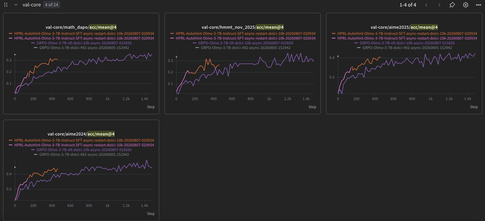

1. Copy /xutao/project/hint_rl/logs/HPRL-AutoHint-Olmo-3-7B-Instruct-SFT-async-restart-dolci-10k-20260807-020934 to your <your-dir>/project/hint_rl/logs/ dir

2. Copy the checkpoint /xutao/project/hint_rl/ckpt/HPRL-AutoHint-Olmo-3-7B-Instruct-SFT-async/HPRL-AutoHint-Olmo-3-7B-Instruct-SFT-async-restart-dolci-10k-20260807-020934/global_step_450 into your <your-dir>/project/hint_rl/ckpt/HPRL-AutoHint-Olmo-3-7B-Instruct-SFT-async/HPRL-AutoHint-Olmo-3-7B-Instruct-SFT-async-restart-dolci-10k-20260807-020934/global_step_450

3. Download allenai/Olmo-3-7B-Instruct-SFT from huggingface to <your-dir>/models/

4. For a test run, submit the script <your-dir>/project/hint_rl/script/hint_rl/launch_hprl_cluster_openai_async_restart_olmo_test.sh; it requires 24 gpus. If wandb login successfully, test is passed, and you can stop the run.

5. For the real resume run, submit the script <your-dir>/project/hint_rl/script/hint_rl/launch_hprl_cluster_openai_async_restart_olmo.sh; It requires 48 gpus for async training

Now the training progress: 16k response length on 10k dataset.

