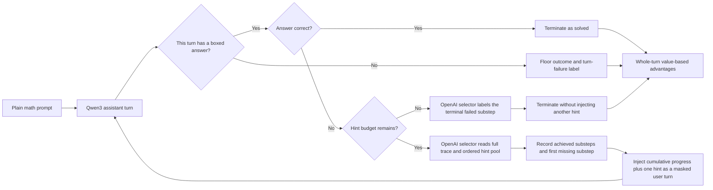

# OpenAI-Selected Auto-Hint HPRL for Qwen3-8B-Base

## Technical method report

**Implementation entry point:** [`launch_hprl_cluster_openai.sh`](./launch_hprl_cluster_openai.sh)  
**Method snapshot:** repository working tree on 2026-07-30

## Abstract

This report specifies the training method selected by the default execution path of
`launch_hprl_cluster_openai.sh`. The method trains Qwen3-8B-Base to solve mathematics
problems through repeated answer attempts. The policy is not taught to request help.
Instead, after each incorrect boxed answer, an external frozen OpenAI model examines the
student trace, identifies the first unfinished substep in an ordered hint ladder, and
injects one hint as a user message. The number of hints available to each problem is a
persisted, per-problem budget that can increase when all sampled attempts fail.

The actor is not trained with one scalar GRPO advantage broadcast over an entire
trajectory. The implementation reconstructs a discrete progress state from the selector's
substep judgments, estimates state values from the eight rollouts of the same problem, and
assigns one value-based advantage to every token of each assistant turn. Advantages are
normalized within each problem group. A value-integrated overlength term distinguishes
turns that finish within the per-turn limit from turns that do not.

This document describes only this concrete variant. It excludes the policy-initiated
`<hint_call/>` method, major-step hint delivery, split prefix/tail advantages, the
verified-prefix mask, k-pack probing, self-hosted selectors, and fully asynchronous
trainer/rollouter variants.

## 1. Scope and launch path

With no method-changing environment overrides, the launch chain is:

```text
launch_hprl_cluster_openai.sh
  -> ../ray_cluster_launch.sh
  -> run_auto_hint_qwen3_8b_base.sh
  -> run_hprl_qwen2.5_7b.sh
  -> main_hprl.py
  -> HPRLRayPPOTrainer + AutoHintAgentLoop
```

The outer launcher makes every pod a training pod in one synchronous Ray/verl job.
There are no selector-serving pods: agent-loop workers call the OpenAI API directly.
The method described below is the unoverridden default of this chain. Most shell
parameters can be changed through environment variables, but doing so may create a
different method variant.

## 2. Problem setting

For each training problem \(q\), the data contains:

- an ordinary math-solving chat prompt;
- a ground-truth answer;
- a stable `problem_id`;
- an ordered hint pool;
- a difficulty-annotated copy of that pool used to compute hint costs; and
- an initial hint budget \(B_q\).

The default training source is
`dataset/dolci-rl-zero-10324-auto-hint.parquet`. Its rows use the ordinary solver
system prompt:

> You are a helpful assistant. Solve the math problem given by the user, reasoning
> step by step, and put your final answer within `\boxed{}`.

After pruning, the effective hint pool is an ordered sequence

\[
\mathcal H_q=(h_0,h_1,\ldots,h_{K-1}).
\]

The associated progress states are

\[
S_k=\text{“the first \(k\) hints in \(\mathcal H_q\) are completed”},
\qquad k=0,\ldots,K.
\]

Each optimizer step samples 64 problems and generates \(N=8\) rollouts for each
problem. The eight rollouts share a problem ID and form the group from which state
values and relative advantages are computed.

The policy sees a normal solver prompt and is not told that a hint mechanism or a
budget exists. Hint selection, budget enforcement, grading between turns, and hint
injection are controlled by the rollout loop.

## 3. Method overview



The method has four coupled components:

1. **Auto-hint rollout.** The policy repeatedly produces complete boxed answers. A
   wrong answer triggers an externally selected hint.
2. **Ordered progress estimation.** The selector identifies substeps the policy
   completed independently and the first substep it still needs.
3. **Hint-penalized value decomposition.** A needed hint has a negative immediate
   reward; independent progress increases the reached state value.
4. **Raise-only budget adaptation.** A problem receives one additional allowed hint
   when none of its eight rollouts is correct.

## 4. Auto-hint rollout

### 4.1 Turn generation and grading

The active rollout is [`AutoHintAgentLoop`](./auto_hint_agent_loop.py), selected by
`agent_name="auto_hint"` in the training parquet.

On each turn, Qwen3 generates at most

\[
\min(8192,\ \text{remaining global response room})
\]

tokens. The loop then applies the following rules:

1. The current assistant turn must contain its own `\boxed{...}` answer.
2. A turn without a box is terminated as a turn-level failure. It receives the same
   treatment as a per-turn length-cap hit.
3. A boxed answer is graded with the same MathRuler grader used by the reward.
4. A correct answer terminates the rollout.
5. A wrong answer continues to hint selection if fewer than \(B_q\) hints have been
   injected.
6. A wrong answer at the budget limit receives one final selector call that labels the
   failed substep but does not inject or charge another applied hint.

The requirement that every turn contain a box is important: the interaction is a
sequence of complete answer attempts, not one unfinished answer split arbitrarily
across user turns. Each injected message explicitly invalidates the preceding boxed
answer.

Injected user-message tokens have `response_mask=0`. They supply context to the next
assistant turn but never receive policy-gradient loss.

### 4.2 Hint selection

The selector uses the multi-round prompt implemented in
[`selector_multi.py`](./selector_multi.py). Before the selector sees the pool, all
general step-guidance entries with IDs of the form `X.0` are removed. The effective
pool therefore contains only ordered substep hints.

For every call, the selector receives:

- the original problem;
- the full student trace so far, including all assistant attempts and previously
  injected hint messages;
- the effective hint pool; and
- a `completed` or `pending` status for each hint.

The selector must scan pending hints in order. It reports:

- every earlier pending hint newly achieved by the current student trace, with a
  supporting quote and a student-notation progress statement; and
- the first pending hint not yet achieved, which becomes the selected hint.

The rollout maintains a cumulative completed set containing both self-achieved hints
and hints previously delivered by the selector. Selected IDs and text are reconciled
against the offered pool before they update this state, limiting damage from malformed,
mislabeled, or repeated selector output.

### 4.3 Progress-aware hint messages

This launcher enables `HPRL_AUTO_HINT_PROGRESS_MESSAGE=true`. Each injected user turn
contains:

1. a statement that the preceding boxed answer is invalid;
2. a numbered list of all progress accumulated so far;
3. the newly selected hint; and
4. an instruction to continue from the verified progress and produce a new boxed
   answer.

The cumulative list includes selector-reported self-achieved progress and all hints
delivered in earlier rounds. The newly selected hint is not listed as already completed
in the same message; it joins the cumulative list on later rounds.

### 4.4 OpenAI selector backend

[`HintSelector`](./hint_selector.py) is instantiated in OpenAI mode with these defaults:

| Parameter | Default |
|---|---:|
| Model | `gpt-5-mini` |
| Reasoning effort | `low` |
| Maximum completion tokens | 16,000 |
| Request timeout | 300 s |
| Maximum attempts | 5 |
| In-flight calls | 16 per agent-loop worker |

Because `gpt-5-mini` is treated as a reasoning model, the request uses
`max_completion_tokens` and `reasoning_effort`; `temperature` and `top_p` are omitted.
Retries use exponential backoff with jitter. Concurrency is capped independently in
each agent-loop worker.

The launcher probes the API's `/models` endpoint from every pod before training. This
prevents a job with no egress or an invalid key from silently converting all hint calls
to no-ops. A selector failure during a rollout terminates that rollout conservatively:
the implementation records a zero-progress, no-failure segment rather than inventing a
state boundary.

## 5. Hint cost and scalar outcome reward

Let \(p_k\ge 0\) be the cost of substep hint \(h_k\). The costs are derived from the
difficulty-annotated `hint_full` field in two stages:

\[
w(d)=1.5^{\ell(d)}, \qquad
\ell(\text{easy})=0,\quad \ell(\text{moderate})=1,\quad \ell(\text{hard})=2.
\]

First, a total cost of 1.0 is divided among major steps according to their difficulty.
Each major-step cost is then divided among its substeps according to substep difficulty.
Guidance hints `X.0` have zero weight, and their share is redistributed to the
substeps. Thus the effective substep costs still sum to 1.0.

If \(\mathcal A_i\) is the set of hints actually injected into rollout \(i\), its scalar
outcome score is

\[
R_i =
\begin{cases}
\max\left(1-\sum_{h_k\in\mathcal A_i}p_k,\ 0.05\right),
& \text{if the final answer is correct},\\[4pt]
0, & \text{otherwise}.
\end{cases}
\]

A length-cap hit or missing-box turn also receives 0 and is marked incorrect. In this
variant there is no hint-call bonus, effort-shaping term, no-hint penalty, format bonus,
or finalize-incorrect reward.

This scalar score remains useful for outcome accounting and supplies the `acc` and
`num_hints` fields used by the budget manager. It is not the final actor advantage:
the trainer overwrites the GRPO advantage tensor with the value-based whole-turn
advantages described next.

## 6. Whole-turn step-level advantage

### 6.1 Rollout annotations

For each assistant turn, the loop records

```text
[turn_start, verified_boundary, turn_end,
 state_start, state_end, is_fail]
```

in response-token coordinates.

In the selected whole-turn variant, `verified_boundary` is retained for diagnostics
but is not used to divide the loss. Every assistant token in the turn receives one
shared advantage. This removes dependence on fuzzy citation localization from the
gradient assignment.

For a failed turn:

- \(s\) is the completed-prefix state before the turn;
- \(e\) is the index of the first substep the selector says is still missing;
- the turn independently advances from \(S_s\) through any newly completed substeps;
- the injected hint completes \(h_e\), so the next turn resumes from \(S_{e+1}\); and
- the immediate reward is \(r_e=-p_e\).

For a solved turn, the terminal state is \(S_K\) and no hint cost is charged.

### 6.2 Group-derived state values

For the eight rollouts of one problem, define:

- \(F_k\): the number of rollouts labeled as failing hint \(h_k\);
- \(D_k\): the number of rollouts that reached state \(S_k\);
- \(T_k\): the number of rollouts whose final turn failed the per-turn protocol at
  state \(S_k\); and
- \(\lambda=0.1\): the overlength surcharge.

The selected `value` overlength mode computes:

\[
V_K=1,
\]

\[
V_k
=V_{k+1}
+\frac{F_k(-p_k)-T_k\lambda}{D_k},
\qquad k=K-1,\ldots,0,
\]

for states with \(D_k>0\). This produces a problem-local value scale from the sampled
rollouts rather than a separately trained critic.

The denominator includes a rollout that reached \(S_k\) and then failed \(h_k\). This
ensures \(F_k\le D_k\) and prevents a failed step from acquiring a positive advantage
through an inconsistent denominator.

If none of the eight rollouts is correct, the entire group is assigned zero advantage.
The implementation deliberately avoids propagating the terminal anchor \(V_K=1\) when
no sampled rollout reached a correct solution.

### 6.3 Turn advantages

An ordinary progress or solving turn receives

\[
A_{\text{turn}}=V_e-V_s.
\]

A turn followed by an injected hint, or terminally labeled as needing hint \(h_e\),
receives

\[
A_{\text{turn}}=-p_e+V_{e+1}-V_s.
\]

If this is the rollout's final turn-level failure, the direct immediate reward also
contains \(-\lambda\):

\[
A_{\text{turn,trunc}}
=-p_e-\lambda+V_{e+1}-V_s.
\]

Every trainable assistant token in the turn receives this same value. The expression
for a failed turn is the telescoped sum of the alternative verified-prefix and
failed-tail advantages, but the selected implementation treats the whole turn as one
macro-action.

### 6.4 Value-integrated overlength term

The \(-T_k\lambda/D_k\) term lowers \(V_k\) when members of the group fail the
per-turn protocol at state \(k\). Since the method does not mean-center the resulting
advantages, non-failing rollouts anchored at the same state receive a relative positive
lift, while a failing rollout also receives its direct \(-\lambda\) charge. The
non-failing versus failing gap remains \(\lambda\), even when several members of the
group fail at the same state.

This penalty applies only to groups containing at least one correct rollout. Missing-box
turns are included in `T_k` alongside literal 8192-token cap hits. A later turn that
exhausts the global 30,720-token response budget is not treated as a per-turn failure;
its unrecorded tail is neutral in the step-level advantage.

### 6.5 Per-group normalization

Raw advantages are normalized separately for each problem group using their population
standard deviation over trainable assistant tokens:

\[
\widehat A_{i,t}
=\frac{A_{i,t}}{\operatorname{Std}_{j,u\in q}(A_{j,u})}.
\]

The target standard deviation is 1.0. There is no mean subtraction: the value recursion
already supplies a group-relative baseline, and a second centering step could change the
intended signs of progress and failure. Groups with near-zero standard deviation are
left unnormalized to avoid numerical amplification.

## 7. Policy optimization

The normalized whole-turn advantages are consumed by verl's clipped PPO actor update.
The relevant defaults are:

| Component | Setting |
|---|---:|
| Problems per step | 64 |
| Rollouts per problem | 8 |
| Advantage path | custom whole-turn step advantage |
| PPO lower / upper clip | 0.20 / 0.28 |
| Loss aggregation | token mean |
| KL reward / KL loss | disabled / disabled |
| Entropy coefficient | 0 |
| Learning rate | \(10^{-6}\) |
| LR schedule | constant after one warm-up step |
| Weight decay | 0.1 |
| Gradient clipping | 1.0 |
| Sequence parallel size | 4 |

Although the base configuration names the estimator `grpo`, the final per-token
advantages and returns are replaced immediately before the actor update. GRPO still
defines the eight-rollout grouping structure; the custom value transform defines the
learning signal.

## 8. Dynamic per-problem hint budgets

The current budget \(B_q\) is stored by `problem_id` in
`<experiment-log-dir>/budget_state.json`. At data-loading time,
[`HintBudgetDataset`](./hint_dataset.py) reads the latest persisted value and updates
only the loop's enforced budget. It never edits the auto-hint prompt, so the policy
remains unaware of both the mechanism and its budget.

After a training step, the budget manager groups the eight outcomes for each problem.
The configured rule is `adaptive` with decreases disabled:

\[
B_q' =
\begin{cases}
\min(B_q+1,6), & \text{if no rollout is correct},\\
B_q, & \text{otherwise}.
\end{cases}
\]

The underlying adaptive rule can propose a decrease when a majority succeeds with
fewer hints, but `allow_decrease=false` vetoes that proposal. Consequently this method
uses a raise-only curriculum: a problem can gain help when the entire sampled group
fails, but it does not lose help after successful steps.

The fallback and upward ceiling are both 6. A previously stored budget above 6 is not
forced downward by this run because the no-decrease guard preserves it.

## 9. Budget-grouped sampling

The train sampler reads the live \(B_q\) table at the start of every epoch. It randomly
permutes rows, drops the changing remainder needed for exact batch divisibility,
stable-sorts the retained rows by current budget, forms 64-problem batches, and shuffles
the batch order.

This keeps most optimizer steps close to budget-homogeneous. Rollouts in the same step
therefore require similar numbers of generation and selector rounds, reducing the
straggler effect in synchronous multi-turn generation. The problem multiset and
eight-rollout grouping are unchanged. K-pack counterfactual probing is disabled.

## 10. Student model and context construction

The policy starts from Qwen3-8B-Base. The wrapper constructs a derived model directory
whose weights and tokenizer files are symlinks to the pristine checkpoint, but whose
`generation_config.json` accepts both:

- `<|endoftext|>` (`151643`), and
- `<|im_end|>` (`151645`)

as EOS tokens. This is necessary because the chat template closes a turn with
`<|im_end|>`. Without the added EOS ID, an otherwise complete turn can continue to the
length cap.

The model's native context window is allocated as:

| Quantity | Default |
|---|---:|
| Maximum original prompt | 2,048 tokens |
| Maximum accumulated response | 30,720 tokens |
| Total context | 32,768 tokens |
| Maximum assistant turn | 8,192 tokens |
| Maximum assistant/user turns | 10 / 10 |
| Rollout sampling | temperature 1.0, top-p 1.0 |

The accumulated response budget includes assistant turns and injected user-hint turns,
although only assistant tokens are trainable.

Validation uses the bare, single-turn `aime2024`, `dapo_sample_hard_100`, `aime2025`,
and `hmmt_nov_2025` datasets without `agent_name="auto_hint"`. Consequently validation
measures unaided generation and does not contact the selector.

## 11. Cluster execution and reproducibility

All pods join one Ray cluster and all GPUs participate in synchronous actor training.
The head pod submits the verl job only after the requested node count has joined.
OpenAI credentials and selector settings are forwarded explicitly through the Ray
runtime environment.

The run stores:

- scalar console, file, and Weights & Biases metrics;
- per-step rollout JSONL files;
- validation rollouts;
- per-call selector dumps, including the exact selector prompt and raw output;
- a persisted budget table; and
- a source snapshot of the complete `hint_rl` directory.

The executable code launches a fresh, timestamped experiment when
`RESUME_EXP_NAME` is unset or empty. If it is set to an existing experiment name,
verl's `resume_mode=auto` restores the latest checkpoint in that experiment directory,
including model, optimizer, and dataloader state. Reusing the same experiment name also
reuses the external `budget_state.json`, which is required to preserve the online
budgets across restarts.

## 12. Failure semantics

The method uses conservative stop behavior because selector or formatting failures
otherwise create incorrect supervision:

| Event | Rollout behavior | Actor-label behavior |
|---|---|---|
| Correct boxed answer | terminate | solved turn reaches \(S_K\) |
| Wrong box, budget remains | select and inject one hint | failed turn labeled at selected substep |
| Wrong box, budget spent | selector labels but does not inject | terminal failed substep is priced |
| No box in current turn | terminate at floor | whole turn is a turn-level failure |
| 8,192-token turn cap | terminate at floor | whole turn is a turn-level failure |
| Later global-context exhaustion | terminate at floor | later unrecorded tail is neutral |
| Hint pool exhausted | terminate | zero-progress, no-failure segment |
| Selector API or parse failure | terminate and log failure | zero-progress, no-failure segment |
| Explicit selector decline | terminate as benign exhaustion | zero-progress, no-failure segment |

## 13. Design assumptions and limitations

The current method should be read with the following assumptions:

1. **Hints form an ordered ladder.** State is the length of a contiguous completed
   prefix. Out-of-order mathematical progress is represented only when the selector can
   justify all preceding pending hints.
2. **The selector is part of the training signal.** A wrong selected substep changes the
   hint shown to the policy and the advantage assigned to the entire preceding turn.
3. **All-incorrect groups do not learn.** They update the future budget, but their actor
   advantages are zero because the terminal value anchor was not reached.
4. **Whole-turn credit is boundary-free but coarse.** It avoids fuzzy quote-boundary
   noise, but independently correct reasoning and unproductive text in the same turn
   receive the same coefficient.
5. **Positive credit is not length-normalized within a turn.** Under token-mean loss,
   every token of a positive turn is reinforced. The method therefore does not directly
   tax redundant restatement below the hard cap.
6. **The value-routed overlength term has a deliberate trade-off.** It rewards being
   within the turn limit relative to truncated peers, which can also lift a concise but
   incorrect turn.
7. **No-correct groups receive no overlength penalty.** This follows from zeroing the
   entire group before the length term is applied.
8. **Selector context and cost grow by round.** Every call embeds the full student trace,
   and progress-aware messages repeat accumulated progress in later turns.
9. **The budget curriculum is one-sided.** The method adds help to universally failed
   problems but never removes help after improvement.

These are properties of the selected implementation, not descriptions of the excluded
method variants.

## 14. Implementation map

| Responsibility | File |
|---|---|
| Cluster topology, OpenAI mode, API preflight | [`launch_hprl_cluster_openai.sh`](./launch_hprl_cluster_openai.sh) |
| Qwen3 model, dataset, and method defaults | [`run_auto_hint_qwen3_8b_base.sh`](./run_auto_hint_qwen3_8b_base.sh) |
| verl and PPO configuration | [`run_hprl_qwen2.5_7b.sh`](./run_hprl_qwen2.5_7b.sh) |
| Trainer substitution | [`main_hprl.py`](./main_hprl.py) |
| Auto-hint state machine | [`auto_hint_agent_loop.py`](./auto_hint_agent_loop.py) |
| Multi-round selector prompt and progress messages | [`selector_multi.py`](./selector_multi.py) |
| OpenAI client, retry, and concurrency logic | [`hint_selector.py`](./hint_selector.py) |
| Whole-turn values and advantages | [`step_advantage.py`](./step_advantage.py) |
| Advantage injection and budget update hook | [`hprl_ray_trainer.py`](./hprl_ray_trainer.py) |
| Scalar correctness and hint-penalized reward | [`hint_reward.py`](./hint_reward.py) |
| Per-hint difficulty weights | [`hint_penalty.py`](./hint_penalty.py) |
| Raise-only budget state | [`budget_manager.py`](./budget_manager.py) |
| Live budget injection | [`hint_dataset.py`](./hint_dataset.py) |
| Budget-homogeneous epoch ordering | [`budget_sampler.py`](./budget_sampler.py) |
